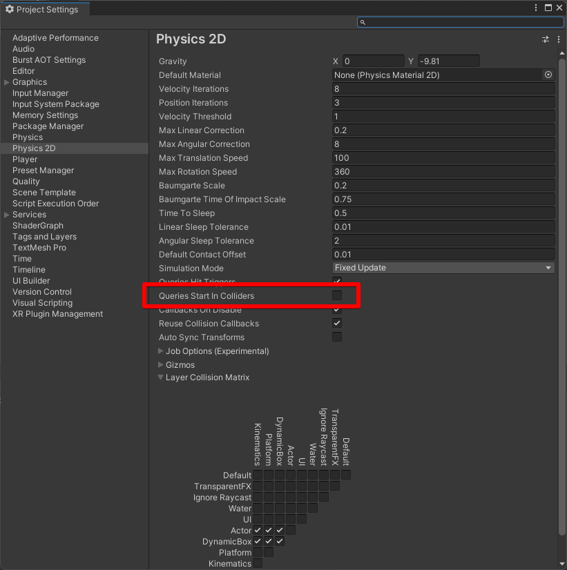

Physics2D.Raycast系のメソッドを使用する際に、発生元を無視する方法です。

!!! Env "環境"
    - Unity 2021.2.5f1

## 何がしたいか

以下のようにRaycast系自身が当たり判定を持つ場合、自分自身にもhitする。
これを自分自身にはhitしないように変更したい

```csharp
[RequiredComponent(typeof(BoxCollider2D))]
class SomeComponent : MonoBehaviour{

  //  ...中略

  private void BoxCastExample(){
    //  他にオブジェクトが無くても hitCount == 1
    int hitCount = Physics2D.BoxCastNonAlloc(
        origin: origin,
        size: _collider.size,
        angle: 0f,
        direction: direction,
        results: hitBuffer,
        distance: distance,
        layerMask: targetMask
    );
  }
}
```

## 方法

ProjectSettings -> Phjysics2D に "Queries Start In Colliders" というチェックボックスがあるので、これをoffにする

